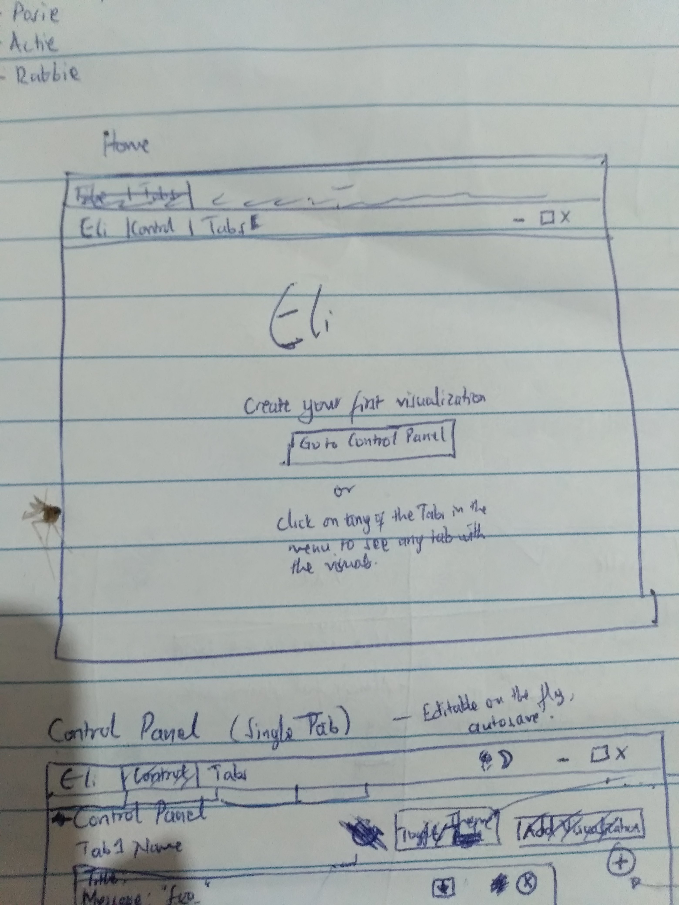
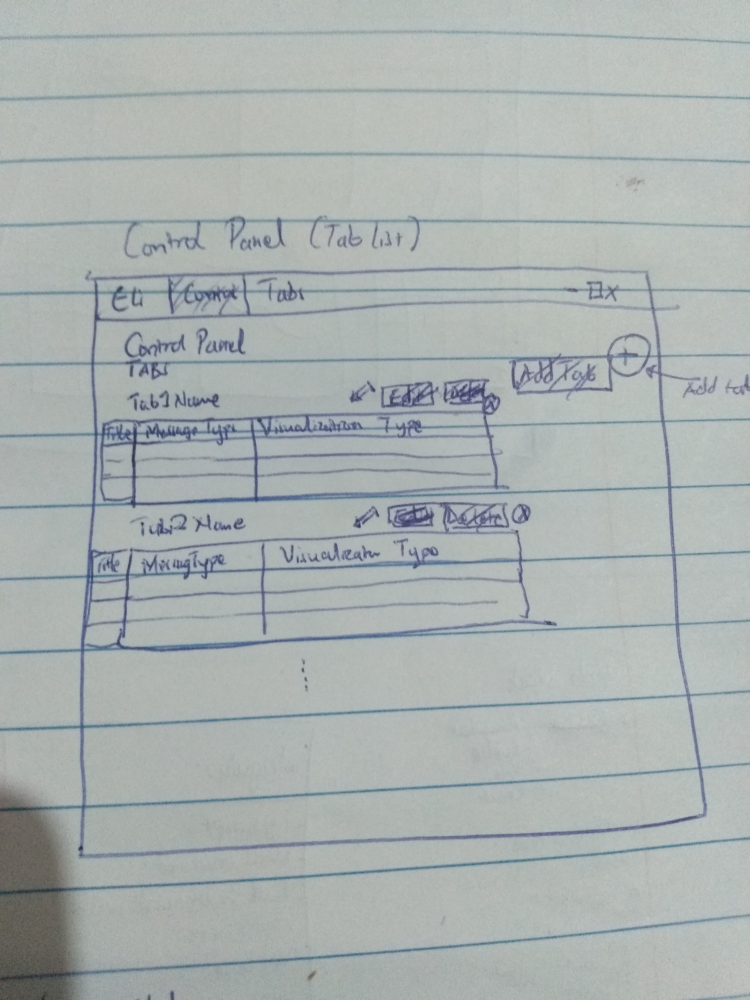
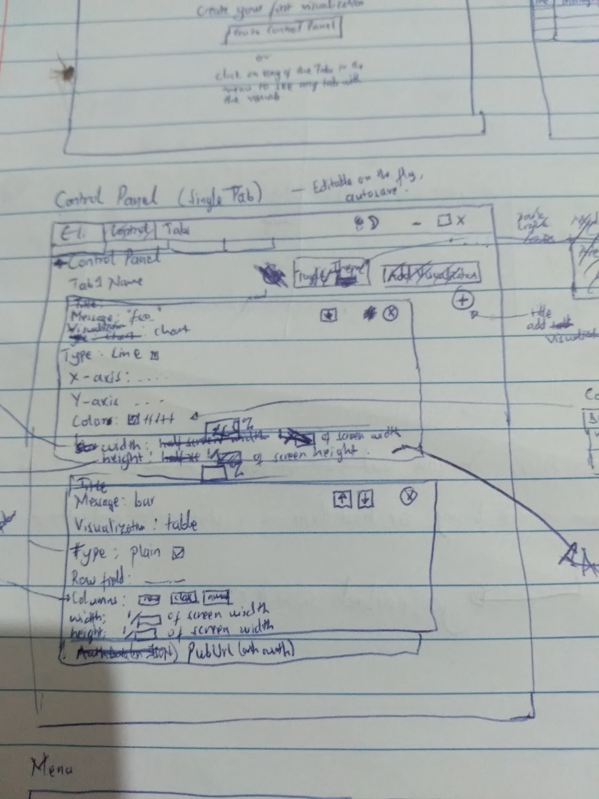
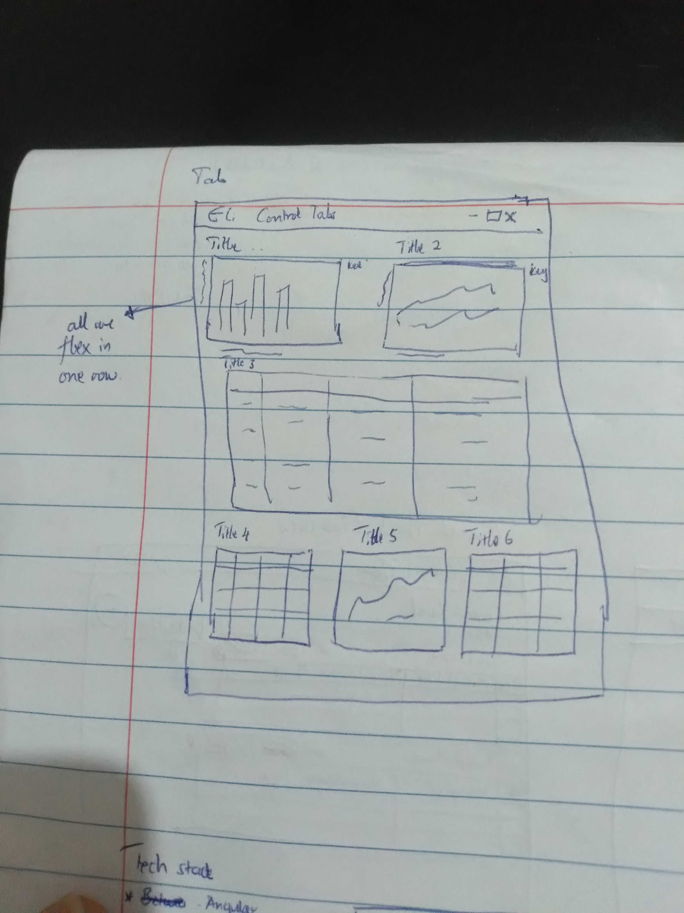
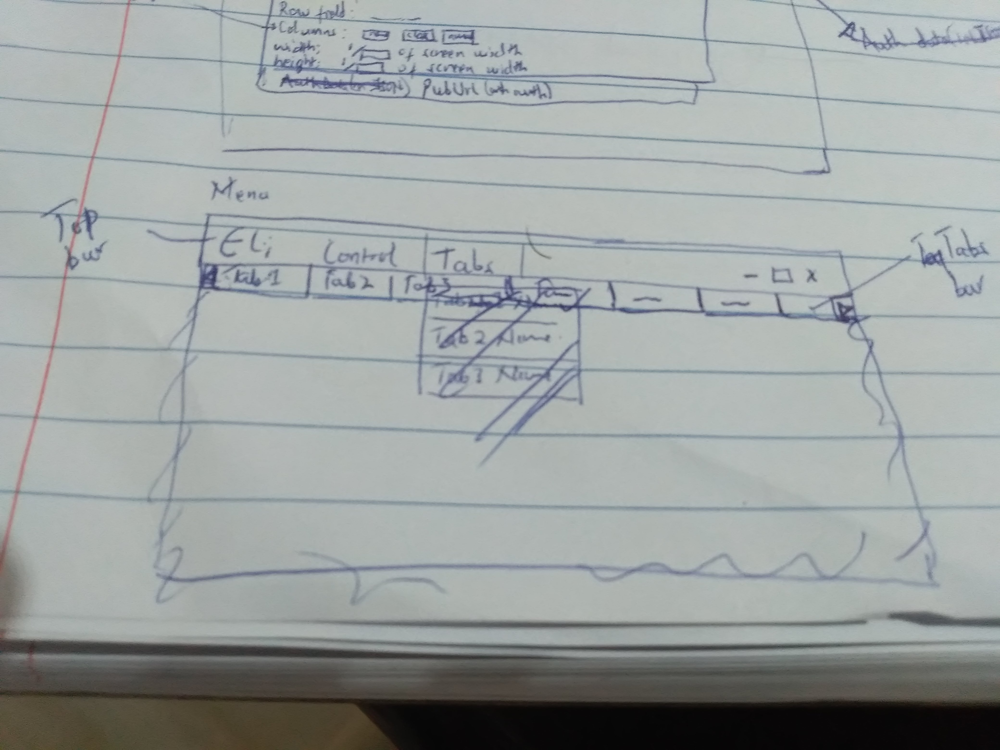
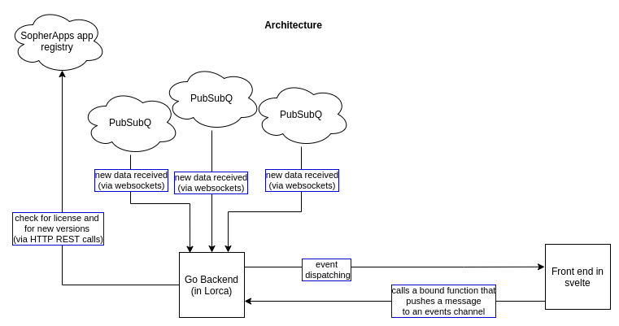

# Eli

This is a Web-based Client application for the [PubSubQ pub/sub app](https://sopherapps.com/store/pubsub/pubsubq/). It allows a user to generate realtime tables, charts, lists etc. basing on the data coming from any number of PubSubQ instances.

## Quick Start

- Open the [Eli app](https://eli.sopherapps.com) in your web browser of choice

- Download the [PubSubQ app](https://sopherapps.com/store/pubsub/pubsubq/) for your operating system and architecture (_note that most computers have AMD64 architecture. If it does not work, you can always download the ARM version_).

  | Operating System | Architecture | Download                                                                                           |
  | ---------------- | ------------ | -------------------------------------------------------------------------------------------------- |
  | Windows          | AMD64        | [Download](https://sopherapps.com/product/versions/PubSubQ/download-latest/?os=windows&arch=amd64) |
  | Windows          | ARM          | [Download](https://sopherapps.com/product/versions/PubSubQ/download-latest/?os=windows&arch=arm)   |
  | MacOS            | AMD64        | [Download](https://sopherapps.com/product/versions/PubSubQ/download-latest/?os=darwin&arch=amd64)  |
  | MacOS            | ARM64        | [Download](https://sopherapps.com/product/versions/PubSubQ/download-latest/?os=darwin&arch=arm64)  |
  | Linux            | AMD64        | [Download](https://sopherapps.com/product/versions/PubSubQ/download-latest/?os=linux&arch=amd64)   |
  | Linux            | ARM64        | [Download](https://sopherapps.com/product/versions/PubSubQ/download-latest/?os=linux&arch=arm64)   |

- Start the PubSubQ instance on port 8080 (You can choose whatever port you want)

  For Linux and Mac:

  ```sh
  ./pubsubq run -p 8080
  ```

  For Windows:

  ```sh
  pubsubq.exe run -p 8080
  ```

- Download the Restie app for your operating system and computer architecture.

  | Operating System | Architecture | Download                                                                                          |
  | ---------------- | ------------ | ------------------------------------------------------------------------------------------------- |
  | Windows          | AMD64        | [Download](https://sopherapps.com/product/versions/Restie/download-latest/?os=windows&arch=amd64) |
  | Windows          | ARM          | [Download](https://sopherapps.com/product/versions/Restie/download-latest/?os=windows&arch=arm)   |
  | MacOS            | AMD64        | [Download](https://sopherapps.com/product/versions/Restie/download-latest/?os=darwin&arch=amd64)  |
  | MacOS            | ARM64        | [Download](https://sopherapps.com/product/versions/Restie/download-latest/?os=darwin&arch=arm64)  |
  | Linux            | AMD64        | [Download](https://sopherapps.com/product/versions/Restie/download-latest/?os=linux&arch=amd64)   |
  | Linux            | ARM64        | [Download](https://sopherapps.com/product/versions/Restie/download-latest/?os=linux&arch=arm64)   |

- Create a file `restieConfig.json` in the same directory that your _Restie_ app was downloaded to.

  ```sh
  touch restieConfig.json
  ```

- Copy, paste and save the following JSON into the `restieConfig.json` file

  ```JSON
  {
    "pipelines": [
      {
        "name": "cet_time",
        "source": "http://worldtimeapi.org/api/timezone/CET",
        "sourceType": "JSON",
        "httpMethod": "GET",
        "isMultiple": false,
        "cronPattern": "@every 0h1m",
        "timestampPattern": "YYYY-MM-DDThh:mm:sszz",
        "datePattern": "YYYY-MM-DD",
        "dataPath": [],
        "timezone": "GMT",
        "primaryFields": ["timezone", "datetime"],
        "separator": "--",
        "pubSubQUrl": "ws://localhost:8080"
      }
    ]
  }
  ```

- Run the _Restie_ app

  For Linux and Mac

  ```sh
  ./restie run
  ```

  For Windows:

  ```sh
  restie.exe run
  ```

- Go back to the eli app in your web browser
- Click on the "Control" Menu item in the top bar
- Click the `+` button on the right of the window that opens
- Change the Title by clicking it and typing. Let's change it to "First Analytic"
- Click the `+` button on the right of that window. A new Card should pop up with empty details.
- Fill in the details as follows:
  <br/>message = cet_time
  <br/>visualization = text
  <br/>type = card
  <br/>width = 80
  <br/>height = 20
- Click the 'refresh' icon at the top of the page.
- Click the "Tabs" menu item in the top bar. And then click "First Analytic". You should be able to see a ticking clock.

## How to Run in Developer Mode

- Clone the repo and enter its root directory

  ```sh
  git clone https://github.com/sopherapps/eli.git
  cd eli
  ```

- Ensure you have node > 10 installed. If not download it from [here](https://nodejs.org/)

- Run the app

  ```sh
  npm start
  ```

## How to Deploy

- Clone the repo and enter its root directory

  ```sh
  git clone https://github.com/sopherapps/eli.git
  cd eli
  ```

- Ensure you have node > 10 installed. If not download it from [here](https://nodejs.org/)

- You will need to enable client side routing for firebase

- TODO

## Design

### Screens

Here are the screens drawn in my little sketch book

#### Home Screen



#### Control Panel (Tabs list)



#### Control Panel (Single Tab)



#### Tab



#### Navigation



### Features

- [ ] A user can select any tab from the `Tabs` bar just below the top bar
- [ ] A user can go to the control panel by clicking the `Control` menu item
- [ ] A user can create any number of tabs, each tab having any number of analytics of any kind.
      This is done in the `Control Panel` by clicking the `+` button at the top right.
- [ ] A user can view all available tabs on the initial page of the control panel
- [ ] A user can edit any tab by clicking the `pen` icon button in that tab's panel
- [ ] A user can navigate backwards in the Control Panel when viewing the settings of one tab.
      Backwards would take them to the list of all tabs
- [ ] A user can delete any tab from the initial screen of the control panel.
      This is done by clicking the `x` button in the card of that tab.
- [ ] A user can add any analytic of any given message type, from any given PubSubQ URL.
      The PubSubQ URL can have the auth data in its query paramters.
- [ ] A user can choose any analytic type for that given analytic, including chart, table, text etc.
      The appropriate configuration for each given canlytic type will be availed to the user to tweak.
- [ ] A user can rearrange the order of the analytics in a given tab.
      This is done by clicking the up or down arrow keys in the card for that analytic.
- [ ] A user can set the title of each tab. Each title is unique to avoid ambiguity when navigating.
- [ ] A user can set the title of a given analytic in any tab. These don't have to be unique.
- [ ] A user can delete any analytic from a given tab by clicking the `x` button in the card of that analytic
- [ ] A user can set the width of a given analytic to be a given percentage of the full width.
- [ ] A user can set the height of a given analytic to be a given percentage of the full height.
- [ ] Analytics on a given tab are all in one flex container with ability to wrap-around
- [ ] Changes made to an analytic are saved automatically every 3 seconds
- [ ] Configurations saved by the user are saved in a JSON file every 3 seconds when the control panel is open.
      In case there are no changes, the JSON file is not touched.
- [ ] At startup, these configurations are loaded from the file.
- [ ] A user can toggle the theme between dark and light by clicking the moon/sun icon in the top bar.
- [ ] Any number of tabs can be open at the same time. The tabs appear just below the top bar.
      If the tabs are too many, they will have an arrow button to enable scrolling left and right.

### Technical Architecture



- This is a simple React App with client-side routing, theme changing, saving of configurations in localstorage and using bootstrap to style the web app
